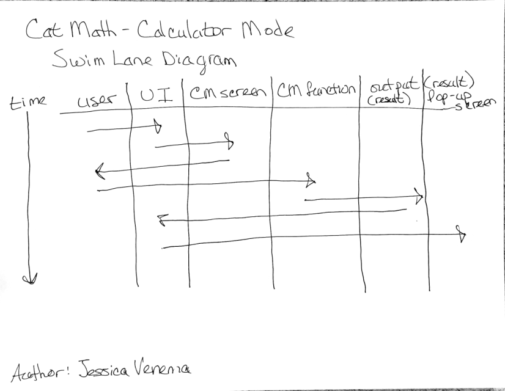
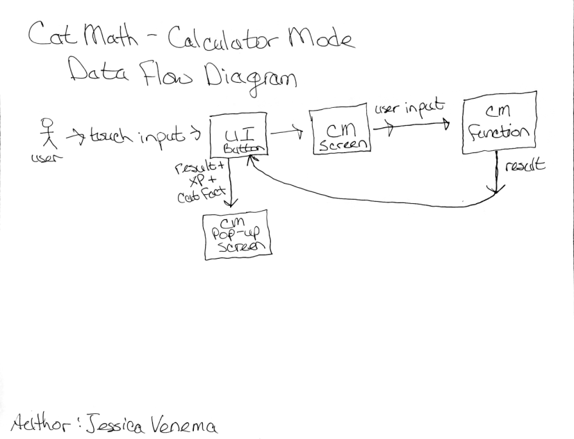

# 1. Design Specification for Cat Math

* Cat Math

* Version 0.1

* Friday, 18 October 2024

* Ben Hawk and Jessica Venema

* Approvers: 

---

## 2. Introduction

* Overview: Cat Math is an Android application for children to practice basic math skills. It features a simple and intuitive interface that kids can easily navigate. The aim of the project is to support classroom math activities at home in a fun and interactive way.

* Purpose:  Why is this project necessary? What problem does it solve?

* Scope: Define the boundaries—what is included and what is not.

* Audience: Children in Kindergarten, 1st, and 2nd grade.

---

## 3. Goals and Objectives

* Primary Goal: What is the main purpose of the project?

* Objectives: Break the goal into smaller, actionable objectives.

* Example: “Implement user login,” “Ensure password encryption,” etc.

Success Criteria: How will you measure success?
Example: “All unit tests pass with 95% coverage.”

---

## 4. System Overview

* Architecture: Describe the high-level architecture (client-server, microservices, etc.). Use diagrams if possible.

* Core Components: What major components are involved (e.g., frontend, backend, database)?

* Technologies: List the programming languages, frameworks, libraries, and tools used. Example: “React for frontend, Node.js for backend, PostgreSQL for the database.”

---

## 5. Functional Requirements

### Requirement 1: The UI shall be engaging and intuitive.
- Engaging User Interface:
   - The user interface shall have large and colorful buttons that will clearly state their purpose, such as the "Game Modes" button, or the home button that will have a home icon.
   - The User's current level and progress shall always be displayed at the top of each screen.
- Intuitive:
  - The Main Menu shall have an option for Game Modes, Avatars, and to quit.
  - The Main Menu shall always be easily accessed by a button in each mode.
  - The Game Modes screen shall have the option for Math Drill, Math Problems, and Calculator Modes.
  - The Avatars screen shall display the current XP and the selected Avatar.
  - The User can shall the phone's backspace button to go back to the last screen. 
  
* UI Charts
  - 
  - 

### Requirement 2: The user shall level up and have a customizable avatar.
- User:
  - The user shall have an array of their owned avatars.
  - The user shall have an avatar variable for their equipped avatar.
  - Users shall unlock new avatars by purchasing them with their total XP, which will not decrease their level or progress to the next.
- Avatar:
  - Avatars shall be animal themed.
  - There shall be only one avatar can be equipped at a time. 
  
* XP and Avatar Charts
  - 

### Requirement 3: The user shall be able to solve math problems using the Calculator Mode. 
- Calculation:
  - The calculator shall have functions for addition, subtraction, mutliplication, and division.
  - The calculator shall display the entire equation on the screen.
  
* Calculator Mode Charts
  - 
  - 
  
### Requirement 4: The user shall be able to practice in the Math Problem Mode.
- Problem Generation:
  - The Math Problem mode shall random math problems that are appropriate for K-2 grades.
  - The math problem shall be checked using the calculator functionality to ensure it is valid.
- Answer:
  - Answering incorrectly shall display the correct answer, and with a slight increase in XP.
  - Answering correctly shall result in more XP given as well as a cat fact.
  
* Math Problem Mode Charts
  - 
  - 

### Requirement 5: The user shall be able to challenge themself in the Math Drill Mode.
- Timer:
  - The Math drill mode shall employ similar problem generation, but with the addition of a timer.
  - The timer shall start at 60 seconds and complete at 0 seconds.
  - Running out of time shall end the user's run. 
- Answer:
  - Entering the incorrect answer shall fail the current run, slightly increase xp, and give the correct answer.
  - Entering correctly shall display the user's equipped avatar and a cat fact, as well as increase xp.
  
* Math Drill Mode Charts
  - 

---

## 6. Technical Design

* Diagrams: Include flowcharts, class diagrams, sequence diagrams, or ERDs if needed.

* Data Structures: List key data structures or schemas. Example: “The User object will contain ID, name, email, and password fields.”

* Algorithms: Describe critical algorithms if any are needed.

---

## 7. Project Plan

* Meeting Location(s) and Times: 
   > In Class: Tuesday and Thursday for 30 minutes 
   >
   > Virtually on Discord: Sunday at 6pm for 1 hour and as needed
* Communication Plan (Meeting Structure & Cadence): 
   > Meeting agenda is posted to Discord before each meeting
   >
   > Prior individual deliverables are communicated in person when available and on Discord 
   >
   > Each topic is covered as planned and the meeting concludes with time for questions, comments, and concerns
   >
   > The current meeting concludes with a brief summary of the discussion, agreements, individual deliverables, team deliverables, and points to cover in the next meeting. This information is posted to the team Discord and documented in the meeting minutes on the team repo.

* Communication Plan Justification:
   > The purpose of meeting at the times and locations is to work with the schedules and course loads for five team members. Due to the location of the team members it was determined that meeting virtually on Discord would be the most efficient use of time. Likewise, the redundancies of the Communication Plan provides all team members with the ability to review a missed meeting or check the specifications for personal responsibilities. 

* Project Management Justification:
   > The project will be managed via meetings and Scrum which will be tracked via Taiga. Decisions are made during meeting by the team members present. Following the Minimum Viable Specification deliverable we will do 2 sprints per check-in with our client. Our check-ins will be every 2 weeks after the MVS is delivered. This will allow us to iteratively include or exclude product features and/or functionality as required by the client. Sprints will focus on achieving the full functionality of a feature (for example a game mode) first with the following sprint focused on testing and code revision. The Minimum Viable Product must be delivered by Friday, 29 November 2024. With this absolute deadline in mind 3 team meetings per week and 1 sprint per week are considered reasonable by the development team.

---

## 8. Testing and Validation

* Testing Strategy: Unit testing, integration testing, end-to-end testing, etc.

* Acceptance Criteria: Define what constitutes project completion.

* Tools for Testing: Mention any testing frameworks (e.g., Jest, JUnit).

